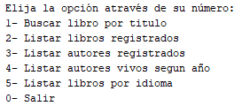

# Literalura

Literalura es una aplicación de consola desarrollada en Java que permite gestionar y consultar información sobre libros y autores utilizando la API de Gutendex. 

## Funcionalidades

La aplicación ofrece las siguientes funcionalidades:

1. **Buscar libro por título:** Permite buscar un libro por su título utilizando la API de Gutendex.
2. **Listar libros registrados:** Muestra una lista de todos los libros registrados en el sistema.
3. **Listar autores registrados:** Muestra una lista de todos los autores registrados en el sistema.
4. **Listar autores vivos según año:** Permite listar los autores que estaban vivos en un año específico.
5. **Listar libros por idioma:** Permite listar los libros registrados en un idioma específico.
6. **Salir:** Cierra la aplicación.

## Uso

### Menú Principal



Al iniciar la aplicación, se muestra un menú principal con las opciones disponibles. El usuario puede seleccionar una opción ingresando el número correspondiente.

### Ejemplo de uso

1. **Buscar libro por título:**
   - Ingrese `1` para seleccionar esta opción.
   - Escriba el título del libro que desea buscar.
   - Si el libro se encuentra en la API, se registrará en el sistema y se mostrarán los detalles del libro y su autor.

2. **Listar libros registrados:**
   - Ingrese `2` para seleccionar esta opción.
   - Se mostrará una lista de todos los libros registrados con sus detalles.

3. **Listar autores registrados:**
   - Ingrese `3` para seleccionar esta opción.
   - Se mostrará una lista de todos los autores registrados con sus detalles y los libros que han escrito.

4. **Listar autores vivos según año:**
   - Ingrese `4` para seleccionar esta opción.
   - Escriba el año para consultar los autores que estaban vivos en ese año.
   - Se mostrará una lista de los autores vivos en el año especificado con sus detalles y los libros que han escrito.

5. **Listar libros por idioma:**
   - Ingrese `5` para seleccionar esta opción.
   - Escriba el código del idioma (es, en, fr, pt).
   - Se mostrará una lista de los libros registrados en el idioma especificado.

6. **Salir:**
   - Ingrese `0` para cerrar la aplicación.

## Requisitos

- Java 17 o superior
- Maven

## Instalación

1. Clone el repositorio:

   ```bash
   git clone 
